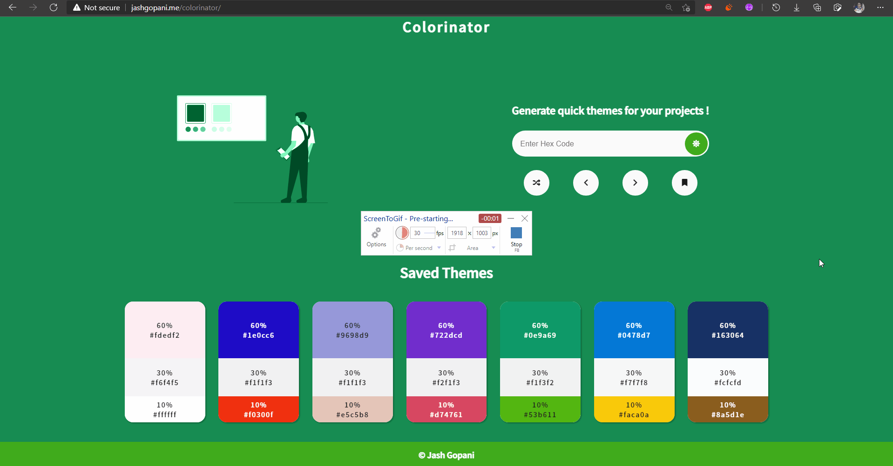

# Colorinator

A quick color palette generator based on the 60-30-10 rule of UI design. 

## Features
- Primary, Secondary and Accent colors are generated
- Colors generated are ** NOT RANDOM **; they are derived using difference of contrast ratio
- Font colors used are calculated based on contrast ratio with background color
- Live preview of invert theme (swapping primary and secondary color)
- Save themes to local storage for future use
- Dynamic look of website makes it easy for you to visualize the look and feel of color palette
- Navigate through the history of color palette
